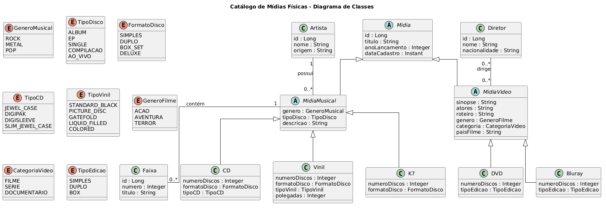

# 📚 Media Collection Catalog

API desenvolvida em Java com Spring Boot para gerenciamento de um catálogo de mídias físicas, como discos musicais e filmes.

## 📊 Diagrama de Classes

Abaixo está o Diagrama de Classes que representa a modelagem completa do domínio da aplicação:



## 🎯 Objetivo

Este projeto foi criado com o objetivo de praticar e demonstrar conceitos fundamentais de desenvolvimento backend, com foco em:

- Modelagem de domínio
- Relacionamentos entre entidades
- Arquitetura orientada a domínio (DDD)
- Boas práticas com Spring Boot

## 🧠 Domínio da aplicação

O sistema é dividido em dois principais domínios:

- 🎵 Mídias Musicais (CD, Vinil, K7)
- 🎬 Mídias de Vídeo (DVD, Blu-ray)

A modelagem utiliza herança para promover reutilização de código e melhor organização das entidades.

## 🧱 Estrutura do Projeto

O projeto está sendo desenvolvido seguindo o padrão **DDD (Domain-Driven Design)** com organização por domínio.

Atualmente, o sistema já contempla dois domínios principais: Música e Filme

##### 💿 Midia (classe base abstrata que representa qualquer tipo de mídia)

---
### 🎵 Domínio de Mídias Musicais
- **MidiaMusical** (especialização de Midia para música)
- **Artista** (relacionamento 1 com mídias musicais)
- **Faixa** (entidade dependente de MidiaMusical)

##### 🎧 Especializações
- CD
- Vinil
- K7

##### 🎵 Enums
- **GeneroMusical** → representa os estilos musicais
- **CategoriaDisco** → classifica o tipo de mídia (álbum, EP, etc.)
- **FormatoDisco** → representa o formado do CD (simples, duplo, box, etc.)
- **TipoVinil** → representa caracterista física do nivil (preto, colorido, picture, etc.)
- **TipoCD** → representa caracterista física da caixa do CD (jewel case, digipack, slipcase, etc.)
---

### 🎬 Domínio de Mídias de Vídeo
- **MidiaVideo** (especialização de Midia)
- **Diretor** (relacionamento N com mídias de vídeo)

##### 🎬 Especializações
- DVD
- Bluray

##### 🎬 Enums
- **GeneroFilme** → representa os gêneros cinematográficos
- **CategoriaVideo** → classifica o tipo de conteúdo (filme, série, etc.)
- **TipoEdicao** → simples, duplo ou box
- **Resolucao** → HD, Full HD, 4K, 8K (aplicado a Blu-ray)


### 📦 Organização

A estrutura segue o modelo *package by feature*, separando claramente os domínios de mídia musical e vídeo, além das entidades relacionadas:

```
br.com.catalogo.mediacollectioncatalog
├── midia
│   ├── domain                // classe base Midia
│   ├── musical
│   │   ├── domain            // MidiaMusical, CD, Vinil, K7
│   │   └── enums             // GeneroMusical, CategoriaDisco, FormatoDisco, TipoVinil, TipoCD
│   └── video
│       ├── domain            // MidiaVideo, DVD, Bluray
│       └── enums             // GeneroFilme, CategoriaVideo, TipoEdicao, Resolucao
├── artista
│   └── domain                // entidade Artista
└── diretor
    └── domain                // entidade Diretor
```


## 🏗️ Tecnologias utilizadas

- Java 21
- Spring Boot 3.5.x
- Spring Data JPA
- PostgreSQL
- Maven

---

### 🔧 Dependências
- Spring Web
- Spring Data JPA
- PostgreSQL Driver
- Validation
- Flyway Migration
- Lombok
- OpenAPI (Swagger)

## 🗄️ Configuração do Banco de Dados

Para executar o projeto, é necessário ter um banco PostgreSQL configurado.

Atualize as propriedades no arquivo `application.properties` com suas credenciais:

```properties
spring.datasource.url=jdbc:postgresql://localhost:5432/collection_catalog_db
spring.datasource.username=SEU_LOGIN
spring.datasource.password=SUA_SENHA
```
> ⚠️ Observação:
> A propriedade `spring.jpa.hibernate.ddl-auto` está comentada para evitar falhas na inicialização, já que o banco ainda não possui estrutura definida e será versionado futuramente com Flyway.
---
## 🚀 Como executar o projeto

```bash
# Clonar repositório
git clone https://github.com/clrangel/media-collection-catalog.git

# Entrar no diretório
cd media-collection-catalog

# Rodar a aplicação

# Linux/Mac
./mvnw spring-boot:run

# Windows
mvnw.cmd spring-boot:run
```