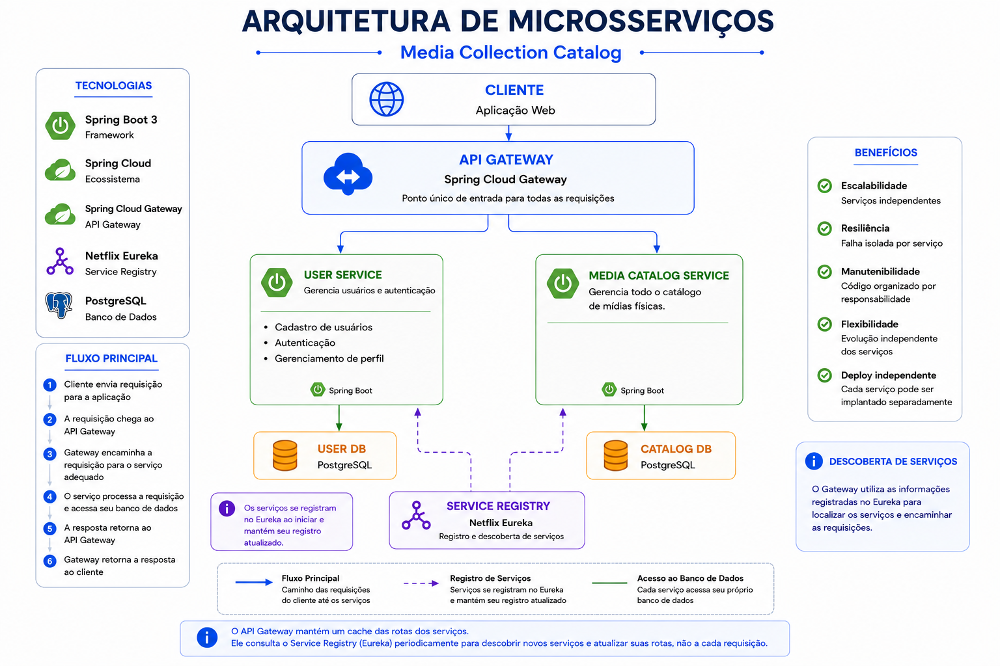

# 📚 Media Collection Catalog

> Plataforma para gerenciamento de coleções de mídias físicas, desenvolvida em Java e Spring Boot, atualmente em evolução de uma arquitetura monolítica para microsserviços.

---
## 🏛️ Sobre a Plataforma

O Media Collection Catalog é uma plataforma voltada para o gerenciamento de coleções físicas, permitindo o cadastro e a organização de diferentes tipos de itens, como CDs, vinis, fitas K7, DVDs e Blu-rays. A arquitetura do projeto foi concebida para permitir a expansão do domínio, possibilitando a inclusão de novos tipos de itens colecionáveis no futuro, como livros, histórias em quadrinhos e outros itens colecionáveis.

O projeto foi concebido inicialmente como uma aplicação monolítica para estudo e prática de conceitos fundamentais de desenvolvimento backend com Java e Spring Boot, incluindo modelagem de domínio, arquitetura orientada a domínio (DDD), mapeamento de dados, persistência com JPA/Hibernate e documentação de APIs.

Atualmente, a solução está em processo de evolução para uma arquitetura baseada em microsserviços, adotando uma abordagem incremental e orientada ao domínio. O objetivo é construir uma plataforma escalável e de fácil manutenção, incorporando gradualmente componentes como API Gateway, Service Registry, autenticação com JWT, comunicação entre serviços e mensageria.

Esta estratégia permite demonstrar não apenas a implementação de funcionalidades, mas também a capacidade de projetar, evoluir e manter sistemas distribuídos seguindo boas práticas de arquitetura de software.

---

## 🏗️ Diagrama de Arquitetura

A imagem abaixo representa a visão atual da arquitetura da plataforma e sua evolução para uma abordagem baseada em microsserviços. Neste primeiro momento, a solução está sendo estruturada em torno de dois serviços principais: o Media Catalog Service, responsável pelo gerenciamento do catálogo de itens colecionáveis, e o futuro User Service, responsável pelo gerenciamento de usuários e autenticação.

A arquitetura também prevê a adoção de componentes de infraestrutura, como API Gateway e Service Registry, permitindo a evolução gradual da solução para um ambiente distribuído, escalável e de fácil manutenção.

<div  align="center">
  
</div>

---

## 🧩 Microsserviços

O projeto está sendo evoluído para uma arquitetura baseada em microsserviços, com o objetivo de melhorar a organização do domínio, a separação de responsabilidades e permitir uma evolução mais escalável da aplicação.

A primeira etapa dessa migração contempla a divisão do sistema em dois serviços principais:

* **User Service:** responsável pelo gerenciamento de usuários, autenticação e informações relacionadas aos usuários da plataforma.

* **Media Catalog Service:** responsável pelo gerenciamento do catálogo de mídias, contendo informações sobre CDs, vinis, K7s, DVDs, Blu-rays, artistas, diretores e demais entidades do domínio.

Essa separação permite que o catálogo de mídias seja independente dos usuários, possibilitando que diferentes colecionadores possam adicionar os mesmos itens às suas coleções sem a necessidade de duplicar os dados do catálogo.

A comunicação entre os serviços será realizada seguindo os princípios de uma arquitetura distribuída, utilizando componentes como:

* **API Gateway:** ponto único de entrada para as requisições da aplicação.
* **Service Registry:** responsável pelo registro e descoberta dos serviços disponíveis.
* **Bancos de dados independentes:** cada microsserviço possui sua própria base de dados, garantindo maior autonomia e isolamento entre os domínios.

A arquitetura foi planejada de forma incremental, permitindo a evolução futura com a inclusão de novos serviços conforme as necessidades do sistema.

---

## 1. 🛠️ Tecnologias

As tecnologias utilizadas no desenvolvimento do projeto foram escolhidas com foco em boas práticas de desenvolvimento backend, organização de código, escalabilidade e manutenção da aplicação.

### Backend

* **Java 21** — Linguagem principal utilizada no desenvolvimento da aplicação.
* **Spring Boot 3** — Framework utilizado para criação da API REST e gerenciamento da aplicação.
* **Spring Data JPA / Hibernate** — Persistência e mapeamento objeto-relacional das entidades.
* **Spring Validation** — Validação dos dados recebidos pelas requisições.
* **Lombok** — Redução de código repetitivo através da geração automática de métodos.
* **MapStruct** — Conversão entre entidades e DTOs de forma segura e performática.
* **Maven** — Gerenciamento de dependências e configuração do projeto.

### Banco de Dados

* **PostgreSQL** — Banco de dados relacional utilizado para armazenamento das informações.
* **Flyway** — Controle de versionamento e migração do banco de dados.

### Ferramentas de Desenvolvimento

* **Git / GitHub** — Controle de versão e hospedagem do código-fonte.
* **Docker** — Tecnologia utilizada para futura containerização das aplicações e padronização do ambiente.
* **IntelliJ IDEA** — Ambiente de desenvolvimento utilizado.
* **Postman** — Testes e validação das APIs REST.
* **Swagger / OpenAPI** — Documentação e testes dos endpoints da API.

### Arquitetura e Comunicação <small>(Tecnologias previstas para evolução da arquitetura)</small>

* **Microsserviços** — Arquitetura adotada para separação de responsabilidades e evolução independente dos serviços.
* **Spring Cloud** — Recursos para construção de aplicações distribuídas.
* **Service Registry** — Registro e descoberta dos serviços da aplicação.
* **API Gateway** — Gerenciamento do acesso aos microsserviços.

### Mensageria

* **RabbitMQ** — Comunicação assíncrona entre serviços através de filas de mensagens.

---

## 🗺️ Roadmap

Evoluções planejadas para o projeto:

- [x] Desenvolvimento da API REST para gerenciamento do catálogo de mídias.
- [x] Implementação das entidades e relacionamentos do domínio.
- [x] Criação de DTOs e mapeamentos utilizando MapStruct.
- [x] Implementação de validações e tratamento de exceções.
- [ ] Migração da arquitetura monolítica para microsserviços.
- [ ] Criação do User Service para gerenciamento de usuários e autenticação.
- [ ] Implementação do API Gateway.
- [ ] Implementação do Service Registry para descoberta dos serviços.
- [ ] Comunicação entre serviços utilizando mensageria.
- [ ] Containerização completa da aplicação utilizando Docker.
- [ ] Orquestração dos serviços utilizando Kubernetes.

---

## 🚀 Como executar a aplicação

### Pré-requisitos

Antes de executar o projeto, certifique-se de possuir:

* **Java 21** — Ambiente de execução da aplicação.
* **PostgreSQL** — Banco de dados utilizado pela aplicação.

### Configuração do banco de dados

Crie um banco PostgreSQL e configure as informações de conexão no arquivo:

```text
application.properties
```

Exemplo:

```properties
spring.datasource.url=jdbc:postgresql://localhost:5432/collection_catalog_db
spring.datasource.username=SEU_LOGIN
spring.datasource.password=SUA_SENHA
```

> O projeto possui suporte ao **Flyway Migration** para versionamento futuro da estrutura do banco de dados.

### Clonando o repositório

```bash
git clone https://github.com/clrangel/media-collection-catalog.git
```

Acesse o diretório:

```bash
cd media-collection-catalog
```

### Executando a aplicação

#### Windows

```bash
mvnw.cmd spring-boot:run
```

#### Linux/Mac

```bash
./mvnw spring-boot:run
```

Após a inicialização, a API estará disponível em:

```text
http://localhost:8080
```

### Documentação da API

A documentação dos endpoints pode ser acessada através do Swagger/OpenAPI:

```text
http://localhost:8080/swagger-ui/index.html
```


